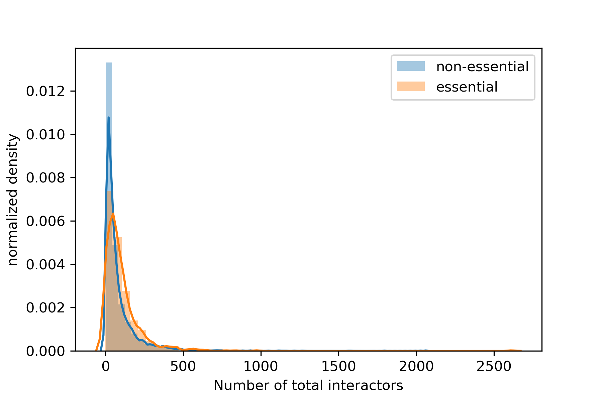
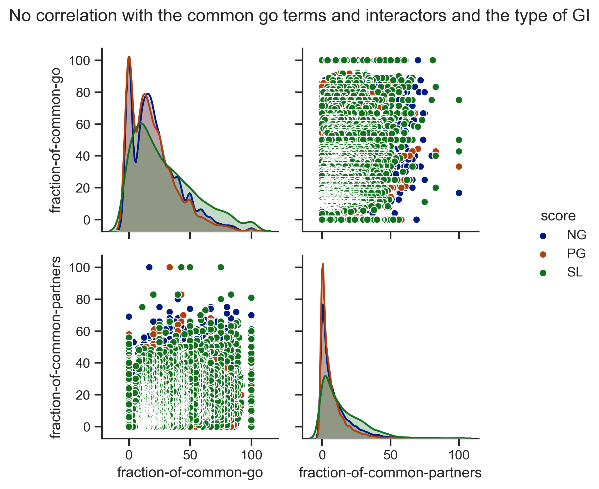
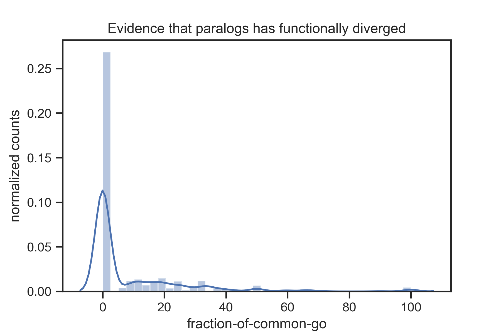
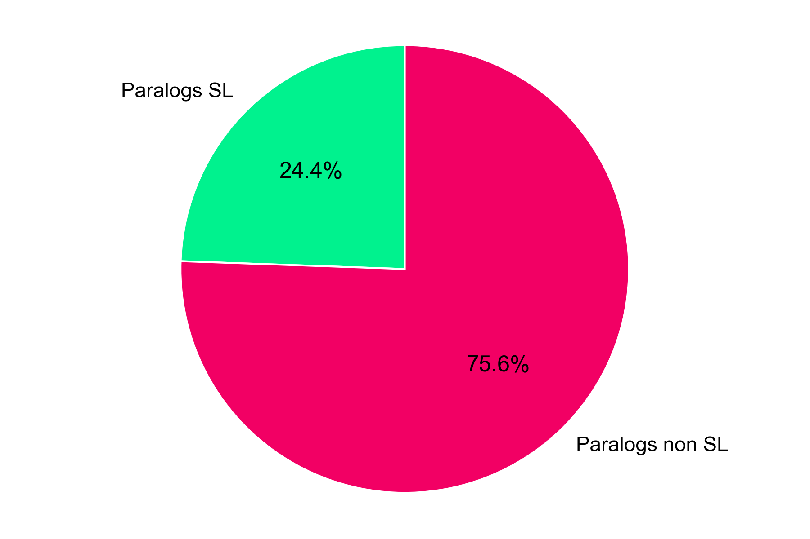
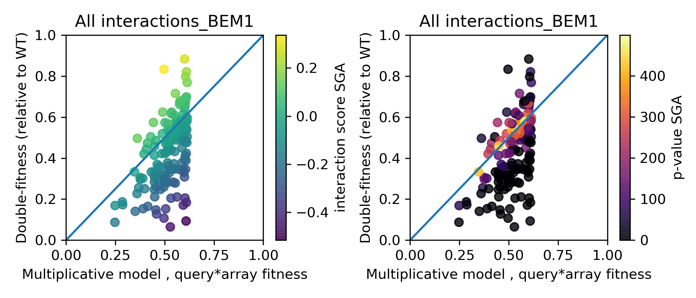
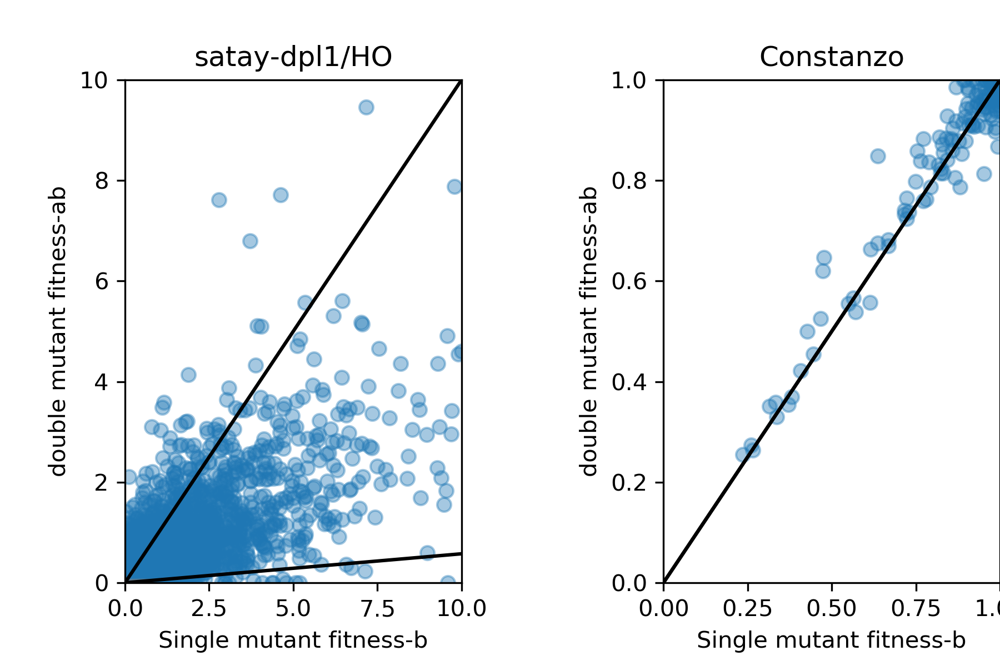

All of the functions and scripts here developed are aimed to answer some simple questions that require the data that is already publicly published. 
The main source of data are the databases:

- [YeastMine](https://yeastmine.yeastgenome.org/yeastmine/begin.do)
- [BioGRid](https://thebiogrid.org/)
- [SGD](http://sgd-archive.yeastgenome.org/curation/literature/)

## Questions guiding bioinformatic studies

1. ***Are the number of genetic interactors of essential genes more than for non essential genes?*** 

    - [GO TO THE SCRIPT](../src(source-code)/script_interactors-of-essential-genes.py)

- Conclusion:
    - Essential genes are slightly more connected than non essential genes. 
    - There are genes low connected that are also essential genes. 

2. ***Is there any correlation with the common go terms and common interactors with the type of genetic interaction a pair of genes has?*** 

    - [GO TO SCRIPT](../src(source-code)/script_big-loop-to-know-interactors-and-go-terms-common.py)

- Conclusion:
    - There is no apparent correlation between common go terms and common interactors with the type of genetic  interaction. 
    - It is interesting that the SL curve is in the tail for both measurements. So, generally SL pairs share more interactors among them and also more common go terms , which could mean that they in general belong to the same functions/modules. 

3. ***Are paralogs functionally divergent?***

- [GO TO SCRIPT](../src(source-code)/script_common_go_for_paralogs.py)

- Conclusion:
    - According to the figure, most of the paralogs have functionally diverged into different functions because most of them **do not share common go terms**. 

4. ***How many paralogs are also synthetic lethal pairs? ***

- [GO TO SCRIPT](../src(source-code)/script_paralogs_and_SL_relationship.py)

- Conclusion:
    - A quarter of the paralogs so far founded in budding yeast are also synthetic lethal.

5. ***Are the interaction scores from Constanzo et al 2016 fitness data from SGA experiments following the multiplicative model?***

- [GO TO SCRIPT](../src(source-code)/script_multiplicative-model-go-terms-ocurrence.py)

- Conclusion:
    - Yes, the scores follows a multiplicative model , because you can see that the points above have positive scores and the points below have negative scores.

6. ***How are the fitness map from SATAY vs SGA of dpl1 gene? ***

- [GO TO SCRIPT](../src(source-code)/script_fitness-map-Constanzo-vs-SATAY.py)

- Conclusion:
    - With SATAY we will have much more data to fill the whole fitness map compared to the existing available SGA data. 

 